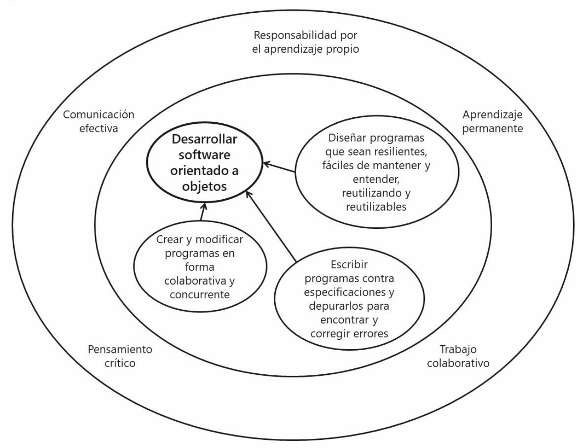
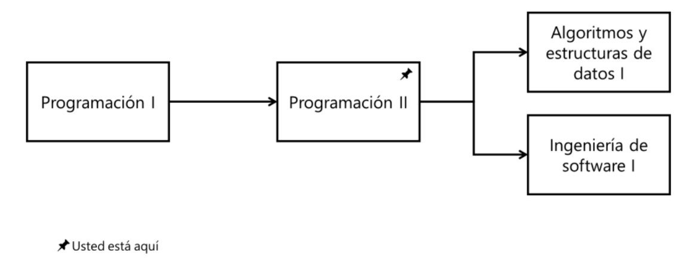
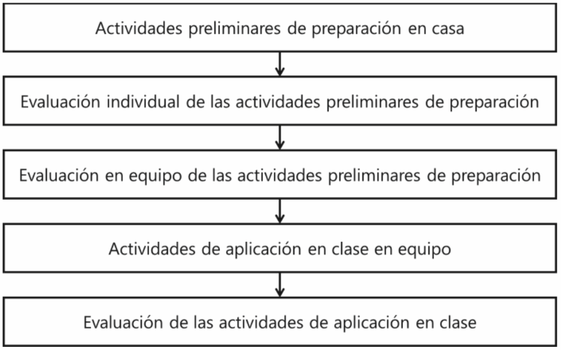

### FIT - Universidad Católica del Uruguay

 

# [Información general del curso](./README.md)

<h2 align=center>Syllabus</h2>
<h3 align=center>Agosto 2020</h3>

<h3 id="content">Contenido</h3>
<ul style="list-style:none">
    <li>
        1. <a href="#about">Acerca del curso</a>
        <ul style="list-style:none">
            <li>
                1.1. <a href="#about_poo">Sobre programación y programación orientada a objetos</a>                
            </li>
            <li>
                1.2. <a href="#course_intention">Intenciones del curso</a>                
            </li>
            <li>
                1.3. <a href="#competences">Competencias</a>                
            </li>
            <li>
                1.4. <a href="#units">Unidades temáticas</a>   
                <ul style="list-style:none">
                    <li>
                        1.4.1. <a href="#objects">Objetos, clases y mensajes</a>                
                    </li>
                    <li>
                        1.4.2. <a href="#types">Tipos y tipos genéricos</a>                
                    </li>
                    <li>
                        1.4.3. <a href="#herarchy">Herencia</a>                
                    </li>
                    <li>
                        1.4.4. <a href="#composition">Composición y delegación</a>                
                    </li>
                    <li>
                        1.4.5. <a href="#exceptions">Excepciones</a>                
                    </li>
                </ul>             
            </li>
             <li>
                1.5. <a href="#course_requisites">Previas</a>                
            </li>
        </ul>
    </li>
    <li>
        2. <a href="#teach">Enseñanza y aprendizaje</a>
        <ul style="list-style:none">
            <li>
                2.1. <a href="#teach_how">Cómo enseñamos</a>                
            </li>
            <li>
                2.2. <a href="#owner">Eres dueño de tu aprendizaje</a>                
            </li>
            <li>
                2.3. <a href="#proyect">Aplicación al proyecto</a>                
            </li>
            <li>
                2.4. <a href="#webasignatura">Webasignatura</a>               
            </li>
        </ul>
    </li>
     <li>
        3. <a href="#course_pass">Aprobación del curso</a>
        <ul style="list-style:none">
            <li>
                3.1. <a href="#assistance">Asistencia</a>                
            </li>
            <li>
                3.2. <a href="#eval">Evaluaciónes</a>                
            </li>
            <li>
                3.3. <a href="#qualification">Calificaciones</a>                
                <ul style="list-style:none">
                    <li>
                        3.3.1. <a href="#scale_qualification">Escala de calificaciones</a>                
                    </li>
                    <li>
                        3.3.2. <a href="#course_qualification">Calificaciones del curso</a>                
                    </li>
                    <li>
                        3.3.3. <a href="#final_approval">Aprobación final</a>                
                    </li>
                </ul>
            </li>
        </ul>
    </li>
    <li>
        4. <a href="#honesty">Honestidad Academémica</a>
    </li>
    <li>
        5. <a href="#competence_details">Detalles de las competencias</a>
    </li>
    <li>
        6. <a  href="#achievement_indicator">Indicadores de logro</a>
    </li>
</ul>

<h2 id="about">1 <a href="#content">Acerca del curso</a></h2>
Los profesores de Programación II te damos la bienvenida al curso.

- Federico Martino  federicod.martino@ucu.edu.uy
- Fernando Machado  fmachado@ucu.edu.uy
- Mauricio Cassani  raul.cassani@ucu.edu.uy
- Nicolás Alliaume  nicolas.alliaume@ucu.edu.uy
- Eduardo Pérez     eduardo.perez@correo.ucu.edu.uy
- Gonzalo Pennino   gpennino@ucu.edu.uy
- Bernardo Rychtenberg brychtenberg@ucu.edu.uy 

<h3 id="about_poo">1.1 <a href="#content">Sobre programación y programación orientada a objetos</a></h3>

<strong>Programar</strong> es diseñar y construir una secuencia de instrucciones (la lógica del programa) para que un computador pueda transformar un conjunto de datos de entrada en otro conjunto de salida -el estado del programa- para resolver un problema. En la <strong>programación lógica</strong> las instrucciones tienen la forma de cláusulas o reglas lógicas y el estado tiene la forma de hechos o afirmaciones; las reglas transforman los hechos en nuevos hechos, que son usados en nuevas reglas, y así sucesivamente. En la <strong>programación funcional</strong> la lógica toma la forma de funciones que transforman los parámetros en resultados; los resultados pueden ser usados como parámetros de otras funciones, y así sucesivamente; no hay estado global, el estado es el conjunto de los parámetros y resultados. En la programación procedural las instrucciones se agrupan en procedimientos que pueden ser invocados por otros procedimientos para manipular un estado global en forma de variables. En la programación orientada a objetos el estado y la lógica se distribuyen de forma razonablemente equilibrada entre un conjunto de objetos que colaboran para lograr que programa haga lo que se espera.

<h3 id="course_intention">1.2 <a href="#content">Intenciones del curso</a></h3>
La intención primaria de este curso es desarrollar la capacidad de producir software de tal forma que los datos y la lógica se distribuyan en forma razonablemente equilibrada entre un conjunto de objetos que colaboran para lograr que el software haga lo que debe. Cuando tengas esa capacidad podrás identificar clases, asignarles responsabilidades, y hacer que colaboren, para así construir aplicaciones de software.

En este curso utilizaremos un lenguaje de programación orientado a objetos y herramientas muy difundidas en la comunidad de desarrollo de software, procurando alcanzar niveles de destrezas satisfactorios en su uso de acuerdo con las expectativas de la industria, así como buenas prácticas de programación de aplicaciones de software de acuerdo con los estándares de la disciplina. 

Es también una intención de este curso el contribuir a desarrollar valores y habilidades para el trabajo colaborativo, la responsabilidad por el aprendizaje propio, la capacidad de resolución de problemas, el pensamiento crítico, la comunicación efectiva y el aprendizaje permanente.

<h3 id="competences">1.3 <a href="#content">Competencias</a></h3>
Este curso busca desarrollar las siguientes competencias específicas; el detalle aparece en el <strong>Detalle de las competencias</strong> en la página 12:
        
- Diseñar programas que resuelvan problemas en términos de objetos y clases, responsabilidades y colaboraciones
- Expresar objetos, clases y las relaciones entre ellos en lenguaje natural, en alguna representación gráfica, y en un lenguaje de programación orientado a objetos; y traducir entre diferentes representaciones.
- Utilizar patrones de diseño orientado a objetos para resolver problemas recurrentes.
- Diseñar programas de forma que sean resilientes, fáciles de mantener y fáciles de entender, reutilizando y reutilizables.
- Crear y modificar programas en forma colaborativa y concurrente.
- Escribir programas contra especificaciones y depurarlos para encontrar y corregir errores.

Los indicadores de logro asociados a estas competencias aparecen en <strong>Indicadores de logro</strong> en la página 13.
También vamos a desarrollar las siguientes competencias generales:
- Comunicación efectiva
- Pensamiento crítico
- Trabajo colaborativo

Queremos que comprendas estos resultados esperados del aprendizaje, trabajes para alcanzarlos y reflexiones sobre el proceso a fin de mejorar continuamente: serás el protagonista activo de tu propio aprendizaje. Para aprender a sistematizar esta reflexión y desarrollar las capacidades de pensamiento crítico, resolución de problemas y de aprendizaje autodirigido, te pedimos que desarrolles y mantengas un portafolio con las reflexiones y experiencias de aprendizaje, que también entregarás al final del curso y sobre el cual podrás consultarnos continuamente.

<h3 id="units">1.4 <a href="#content">Unidades temáticas</a></h3>
El curso de desarrollará en varias unidades temátic1as que cubren diferentes aspectos de las competencias desarrollar y actuando coordinadamente apunta al logro de los objetivos y resultados de aprendizaje.

Para ello cada unidad temática describe las intenciones y los resultados esperados del aprendizaje específicos de la unidad.

<h4 id="objects">1.4.1 <a href="#content">Objetos, clases y mensajes</a></h4>
Repasamos la esencia de un programa orientado a objetos. Introducimos la especificación de clases, responsabilidades y colaboraciones. Explicamos y usamos el patrón de diseño Expert y el principio Single Responsibility Principle para comenzar a descomponer en clases.

<h4 id="types">1.4.2 <a href="#content">Tipos y tipos genéricos</a></h4>
Vemos qué es un tipo, cómo crear tipos, cómo un objeto puede tener varios tipos, y cómo varios objetos pueden tener el mismo tipo; también vemos la relación entre tipos y clases. Explicamos y usamos el patrón de diseño Polymorphism y el Liskov Substitution Principle para comenzar a diseñar en base a principios.

Entendemos cómo generar tipos en función de otros para clasificar abstracciones en forma horizontal

<h4 id="herarchy">1.4.3 <a href="#content">Herencia</a></h4>
Entendemos cómo usar la herencia para clasificar abstracciones usando relaciones de generalización y especialización.
Explicamos y usamos el patrón de diseño Creator y el principio Open/Closed para continuar descomponiendo en clases y diseñando en base a principios.

<h4 id="composition">1.4.4 <a href="#content">Composición y delegación</a></h4>
Vemos cómo un objeto puede usar otros en los que delega sus responsabilidades. Introducimos cohesión y acoplamiento y presentamos porqué es necesario maximizar lo primero y minimizar lo segundo. Explicamos y usamos los patrones de diseño Low Coupling, High Cohesion, y Don’t Talk to Strangers y los principios Dependency Inversion e Interface Segregation para continuar descomponiendo en clases y diseñando en base a principios.

<h4 id="exceptions"> 1.4.5 <a href="#content">Programar contra especificaciones</a></h4>
Vemos cómo definir cuándo un programa es correcto, cómo corregirlo cuando y no es correcto y cómo controlar el flujo de ejecución cuando los programas encuentran situaciones que no están preparados para resolver.

<h3 id="course_requisites">1.5 <a href="#content">Previas</a></h3>
Programación II tiene como previa Programación I. Asumimos que ya puedes construir programas utilizando los conceptos de variables y operaciones, estructuras de control de flujo, funciones y parámetros, clases y objetos.

> ⚠️ **Nota**
>
> En Programación I usaste Python, mientras que en Programación II usaremos C#. En webasignatura podrás encontrar
> ayuda para hacer en C# las cosas que sabes hacer en Python.

A su vez, Programación II es previa de Algoritmos y estructuras de datos I y de Ingeniería de software I.

<h2 id="teach">2 Enseñanza y aprendizaje</h2>
<h3 id="teach_how"> 2.1 <a href="#content">Cómo enseñamos</a></h3>
Entendemos que aprendes a programar programando. Es decir, podemos explicarte toda la teoría para hacer un programa, pero hasta que no te enfrentas a un editor de código y un compilador u otras herramientas necesarias para hacer programas, no vas a terminar de incorporar los conceptos y habilidades que se necesitan para programar.

>⚠️ Nota
>
>Y eso es sólo el comienzo. Programar no es sólo escribir el código, compilarlo, y lograr que el progra ma haga lo que se supone. Mira por ejemplo este link para tener una idea.

Por eso, en este curso no hay clases teóricas y prácticas separadas; y también por eso, te pedimos que traigas tu portátil cargado a todas las clases, con el ambiente de desarrollo en condiciones de trabajar.

En las primeras clases te vamos a mostrar cómo configurar tu ambiente de desarrollo con las herramientas que vamos a usar durante el curso para programar. Esperamos que a partir de la segunda clase tengas todas las herramientas correctamente instalas y configuradas para trabajar.

Contamos con ello, si tienes problemas con alguna herramienta, por favor nos avisas antes del comienzo de la segunda clase.

> ⚐ Importante
> 
> Cuidar tu ambiente de desarrollo es una cuestión de actitud. Una herramienta mal instalada o mal configurada, algo que no funciona como debe, les puede traer problemas y les va a hacer perder tiempo; para evitar perder tiempo, es necesario invertir tiempo en mantener el ambiente de desarrollo funcionando correctamente1.

Al comienzo de cada unidad temática vamos a pedirte que realices antes de venir a clase algunas actividades preliminares de preparación para el aprendizaje en clase. Las actividades preliminares incluyen lectura de material creado por los profesores, capítulos de libros, artículos de revistas, videos disponibles en línea, etc. en webasignatura 2. Vamos a evaluar que hayas realizado las actividades preliminares, pues son parte del proceso de aprendizaje. El detalle de esta evaluación está más adelante en la sección Evaluaciones, en la página 9 de este documento.

Dedicaremos la primera clase de cada unidad temática a un proceso de aseguramiento de la preparación (PAP), que tiene por objetivo asegurar que los miembros del equipo se encuentran en condiciones óptimas para luego desarrollar los trabajos de aplicación. En este PAP realizaremos:

- Una medición de la comprensión y aprovechamiento de las actividades preliminares de preparación indicadas, mediante un cuestionario que resolverás en forma individual. 
- Una discusión en equipo de las mismas preguntas planteadas en el cuestionario individual, elaboración de una respuesta grupal, y realimentación inmediata de los resultados.
- Eventualmente, apelación sobre preguntas o respuestas de los cuestionarios que fueran mejorables, a través de la discusión en el equipo y mediante la revisión del material de lectura previa indicado.
- La explicación por parte del docente de las dudas que hayan quedado luego de realizadas las actividades anteriores.

El resto de la unidad temática será destinado a resolver en equipo diversas tareas de aplicación de los conceptos de esa unidad temática, típicamente programando o creando representaciones visuales del código.

Las definiciones de términos necesarios para entender los conceptos están disponibles en "tarjetas" en webasignatura 3.
Las tarjetas simulan las que se usaban antiguamente -o no tanto- en las bibliotecas para indexar los libros. Imprime y ten a mano las tarjetas de cada tema al comienzo. Tener las tarjetas a mano ayuda a buscar rápidamente las definiciones y familiarizarse con ellas.

> ⚐ Importante
> 
> Vamos a tener en cuenta en las evaluaciones que llamen a las cosas por su nombre, tal como están definidos en las tarjetas; sólo de esa forma los profesores podemos saber a qué conceptos o términos hacen referencia en sus respuestas y entregas.

En caso de que no puedas terminar de programar por tu cuenta en el tiempo disponible alguno de los ejemplos que programamos los profesores, el código está disponible en un repositorio llamado GitHub 4 . Accede al repositorio para ver al código de ejemplo una vez que hayas intentado programarlo por tu cuenta, si no has podido terminarlo; o si has podido, pero quieres comparar lo que has hecho con lo que hemos mostrado en clase. Ten en cuenta que en algunos casos hay más de una forma correcta de codificar.

Después de esa introducción, vamos a realizar una o varias actividades de aplicación en clase. Esas actividades pueden ser:

<table id="card">
    <tr style="background-color:#006DA7;color:#FFFFFF;padding:5px">
        <th align="left">
        </th>
        <th align="left">
            <h3>Actividad</h3>
        </th>
        <th align="left">
            <h3>Descripción</h3>
        </th>
    </tr>
    <tr style="vertical-align: top;text-align: justify;">
        <td style="vertical-align: middle">
                 
        <td>
            

                Juego de roles
            

        </td>
        <td>
            

                Típicamente combinado con tarjetas CRC, formamos grupos de estudiantes y asignamos a cada grupo el rol de un objeto en una interacción.
            

        </td>
    </tr>
    <tr style="vertical-align: top;text-align: justify;">
        <td style="vertical-align: middle">
                 
        </td>
        <td>
            

                Dibujos y poster
            

        </td>
        <td>
            

                Una imagen vale más que mil palabras, por eso vamos a dibujar y hacer posters mostrando relaciones entre clases e interacciones entre objetos. No vamos a usar ninguna herramienta, sólo marcadores y papel. Tampoco vamos a usar ninguna notación formal, pero sí nos pondremos de acuerdo en cómo dibujar algunas cosas básicas.
            

        </td>
    </tr>
    <tr style="vertical-align: top;text-align: justify;">
        <td style="vertical-align: middle">
                 
        </td>
        <td>
            

                Programación
            

        </td>
        <td>
            

                Pequeños programas, que haces y entregas en clase.
            

        </td>
    </tr>
    <tr style="vertical-align: top;text-align: justify;">
        <td style="vertical-align: middle">
                 
        </td>
        <td>
            

                Evaluación entre pares
            

        </td>
        <td>
            

                Provees retroalimentación a otro estudiante, o grupo de estudiantes, sobre una actividad y siguiendo una consigna.
            

        </td>
    </tr>
</table>

En resumen, cada unidad temática tiene la siguiente secuencia:

Vamos a pedirte que hagas algunas cosas más que escribir y compilar código, que son importantes en programación.

Una de ellas es probar tu propio código para asegurarte que funciona como debería. Vamos a enseñarte a usar programas -de prueba- para probar lo que programas. Aunque no es posible asegurar que el programa de prueba es correcto -y en consecuencia que el programa probado es correcto-, es una forma de minimizar los errores introducidos al programar.

> ◬ Nota
>
>Vamos a mostrarte cómo hacer estos programas de prueba, pero puedes mirar este link para ir teniendo una idea.

Otra cosa importante es documentar tu programa, es decir, agregar información que permita saber qué hace tu programa a otras personas -o a ti mismo más adelante-. Vamos a enseñarte como agregar documentación del código en el propio código, y a usar herramientas para generar páginas web de documentación en forma automática. De esta forma es más fácil crear y mantener actualizada la documentación del código.

> ◬ Nota
>
> Puedes mirar este link para tener más información sobre cómo crear documentación embebida en el código 

También es importante usar un repositorio para programar tranquilo. Un repositorio evita que pierdas tu trabajo, ya sea porque pasa algo en tu ambiente, porque introduces un error inesperado que quisieras deshacer, o porque quieres colaborar con otros compañeros, ya sea permitiéndoles modificar lo que tú programas, o permitiéndoles ver lo que has programado y que te hagan comentarios.

<h3 id="owner">2.2 <a href="#content">Eres dueño de tu aprendizaje</a></h3>
Los profesores podemos enseñarte, pero sólo tú puedes aprender. En este curso queremos enseñarte a programar, pero también queremos que aprendas a aprender. Aunque nunca más programes 5 , aprender es algo que haces durante toda tu vida.

> ⚐ Importante
>
>  Consideramos que aprendas a aprender tan importante, que vamos a pedirte que hagas el curso en línea “Aprendiendo a aprender: Poderosas herramientas mentales con las que podrás dominar temas difíciles” en Coursera: https://www.coursera.org/learn/aprendiendo-a-aprender. Este curso insume máximo unas quince horas entre videos, ejercicios y material adicional. Obtendrás cinco puntos adicionales en la nota del proceso de aprendizaje 6 en caso de que completes el curso dentro de las primeras cuatro semanas del curso.

No importa cómo aprendas, pero sí es importante que sepas cómo aprendes, para que puedas hacerlo de la forma más conveniente para ti. Reflexiona frecuentemente, cada vez que te equivocas, sobre qué fue lo que faltó, o qué hubieras podido hacer diferente.

Como el tiempo que necesitas para incorporar un concepto, o desarrollar una capacidad o habilidad, depende sólo de ti y es diferente en todos nosotros, también es importante que planifiques los días y las semanas de forma de darte el espacio que necesitas.

> ⚐ Importante
>
>Como dijimos antes, aprendes a programar programando. Para programar necesitas una computadora; y un ambiente de desarrollo en condiciones. Es necesario, entonces, que traigas tu computadora a todas las clases.

> ⚐ Importante
> 
> Trata de resolver los problemas, por ejemplo, los errores al compilar un programa, buscando información por tu cuenta; hoy estamos los profesores, pero mañana vas a tener que arreglártela por tu cuenta. Esta es una habilidad que queremos que desarrolles.

Esperamos que comprendas las competencias que deberás desarrollar -y los indicadores de logro asociados-, que trabajes para desarrollarlas, y que reflexiones sobre el proceso a fin de mejorar continuamente: serás el protagonista activo de tu propio aprendizaje. Para aprender a sistematizar esta reflexión y adueñarte de tu aprendizaje, te pediremos que desarrolles y mantengas un portafolio con las reflexiones y experiencias de aprendizaje, que también entregarás al final del curso y sobre el cual podrás consultar continuamente con los profesores.

<h3 id="proyect">2.3 <a href="#content">Aprendizaje basado en proyectos y en equipos</a></h3>
En este curso la mayor parte del trabajo que hagas será aplicado a un proyecto que realizarás en equipos. La integración de los equipos es definida por los profesores al comienzo del curso y no cambia durante el proyecto. Te vamos a dar las características del proyecto durante el curso. Ahora es importante saber que:

- El proyecto está centrado en enseñarte los conocimientos y desarrollar las competencias que son objeto de este curso; no es un accesorio sino el núcleo del curso.
- Te permite desarrollar habilidades valiosas para el mundo de hoy, tales como el pensamiento crítico, resolución de problemas, colaboración y comunicación, que se enseñan y evalúan como parte del proyecto.
- Participarás en un proceso riguroso y extenso de hacerte preguntas y desarrollar las respuestas haciendo preguntas; los profesores estamos para ayudarte, pero tú eres el protagonista.
- Estará articulado alrededor de una pregunta disparadora que explorarás; la pregunta es abierta, no hay una única respuesta, no conocemos la solución de antemano.
- Verás claramente la necesidad de construir conocimientos, comprender los conceptos, y aplicar habilidades con el fin de responder a esa pregunta abierta, comenzando con un evento de lanzamiento.
- Decidirás cómo crear los productos, cómo funcionarán, y cómo utilizarás tu tiempo; los profesores estamos para guiarte, pero tú eres el responsable.
- Habrá múltiples instancias de evaluación y retroalimentación, para que puedas considerar mejoras que conducen a productos de mejor calidad; y a pensar en qué y cómo estás aprendiendo.
- Será un proyecto real que haremos para una audiencia pública externa auténtica; lo presentarás a esa audiencia, llegado el momento.

El equipo es el vehículo con que cuentas para realizar un mejor trabajo en forma efectiva: aprender. De ahí la importancia que tu equipo sea lo más productivo posible, a efectos de que tú y cada uno de tus compañeros puedan lograr los mayores niveles de aprendizaje.

<h3 id="webasignatura"> 2.4 <a href="#content">Webasignatura</a></h3>
La webasignatura de nuestro curso contiene todos los materiales necesarios, o tiene vínculos a otros materiales: https://webasignatura.ucu.edu.uy/course/view.php?id=288.

El foro de anuncios generales de la web asignatura es el medio de comunicación básico de los profesores.

>⚐ Importante
>
>Es tu responsabilidad verificar, una vez cerrado el plazo de inscripciones al curso, el estado de tu registro en webasignatura. También es tu responsabilidad la consulta habitual a webasignatura para tomar conocimiento de todas las comunicaciones y avisos efectuados por los profesores, referentes a cualquier aspecto relacionado con el desarrollo de la asignatura, por ejemplo, fijación de fechas de parciales, salones, correcciones, comunicaciones generales, etc.

> ◬ Nota
>
> Si tienes consultas por temas administrativos, de agenda, de gestión o personales, preséntalos personalmente a los profesores o a las autoridades correspondientes de la carrera.

<h2 id="course_pass"> 3 <a href="#content">Aprobación del curso</a></h2>
<h3 id="assistance">3.1 <a href="#content">Asistencia</a></h3>
La asistencia no es sólo venir a clase, sino estar presente en clase. Estar presente quiere decir tener la cabeza puesta en la clase, no en algo que pasó antes, ni en algo que va a pasar luego. Estar presente es participar escuchando activamente, preguntando cuando tienes dudas, evitando hacer cosas que no tienen que ver con la clase.

Los profesores registramos la asistencia al comienzo de cada clase7, debes estar presente para que cuente como asistencia; y debes permanecer presente en clase, para que cuente como asistencia.

> ⚐ Importante
> 
> No contará como asistencia, sin ninguna excepción, la llegada luego del control.

El registro de asistencia queda publicado en autogestión en tiempo real.

Cualquiera puede tener un inconveniente que los haga llegar tarde, o que evite que asistan a una clase. El porcentaje de asistencia requerido para la aprobación del curso tiene en cuenta esos casos, no le pidas a los profesores que te cuenten la asistencia cuando has llegado tarde, te retires temprano, o no estés presente en clase.

Sabemos que en este mundo hiperconectado en el que vivimos, es difícil estar presente; las redes sociales y las aplicaciones de mensajería instantánea nos lo recuerdan a cada rato. Evita estar pendiente de lo que pasa en tus dispositivos, que no tenga que ver con la clase, mientras estás en clase. Lo vamos a tener en cuenta en la evaluación, y puede llegar a que no te contemos presente en una clase, aunque hayas asistido. Si algo urgente ocurre, coméntaselo a los profesores y trata de resolverlo saliendo unos minutos de clase.

<h3 id="eval">3.2 <a href="#content">Evaluaciones</a></h3>
Todas las instancias de pruebas individuales serán realizadas exclusivamente en el recinto del salón de clase, y serán iniciadas puntualmente a la hora indicada.

Podrás participar en la prueba individual aún si llegas tarde: tendrás disponible para realizarla el tiempo que reste para la hora de cierre establecida para esa prueba.

Las evaluaciones de las actividades preliminares, de las actividades de aplicación, o de la defensa, podrán ser tomados utilizando cuestionarios en webasignatura. Por esta razón, en los días que haya pruebas será imprescindible que concurras con tu computadora personal debidamente configurada para acceder a la webasignatura, realizar las pruebas y utilizar las herramientas de desarrollo del curso. Te recomendamos verificar esta configuración con antelación y comprobarlo unos minutos antes de la prueba, así puedes resolver eventuales problemas y evitar nervios inconvenientes.

Hay varios tipos de evaluaciones que haremos durante el curso . Al inicio de cada unidad temática haremos una evaluación de la preparación para el aprendizaje, o RAT8 por sus siglas en inglés. Esta evaluación tiene dos partes y, en consecuencia, dos calificaciones. Una -IRAT- es individual y consiste en contestar algunas preguntas sobre la preparación previa, sin consultar ninguna referencia ni tampoco a tus compañeros. La otra -TRAT- consiste en contestar las mismas preguntas, luego de consensuarlas con tu equipo. La calificación del TRAT es la misma para todos los integrantes del equipo.

Luego de los RAT haremos actividades de aplicación en equipos, que también serán evaluadas. La calificación de las actividades de aplicación es la misma para todos los integrantes del equipo. El criterio de evaluación de los IRAT y los TRAT es el mismo: las preguntas son múltiple opción y la respuesta correcta a esas preguntas se proporciona al final de realización del RAT; la calificación es proporcional a la cantidad de respuestas correctas.

El proyecto tiene tres entregar parciales y una entrega final; la calificación de las actividades de aplicación es la misma para todos los integrantes del equipo.

El criterio de evaluación del proyecto es mediante una rúbrica que se proporciona junto con el enunciado cuando comienza el proyecto. La rúbrica indica las evidencias observables de desarrollo de las competencias del curso -consulta Detalle de las competencias en la página 12- según niveles de suficiencia -del más bajo al más alto-: ”insuficiente”, “insipiente”, “en desarrollo” y “experto”. La calificación es relativa al nivel de desarrollo de las competencias: deberás alcanzar el nivel “experto” en al menos cuatro de las seis competencias del curso, y el nivel “en desarrollo” en las demás, para obtener calificación superior 75% en el proyecto.

El proyecto también tiene una defensa escrita, que consiste en contestar preguntas sobre tu proyecto. Opcionalmente los profesores podemos llamar a una defensa oral, para revisar contigo las respuestas de tu defensa escrita. La calificación de la defensa es individual.

El criterio de evaluación de la defensa es igual al del proyecto: utiliza la misma rúbrica y la misma forma de calificar en relación al nivel de desarrollo de las competencias.

Junto con cada entrega parcial y la entrega final del proyecto haremos una evaluación entre pares. En esta evaluación el resto de los compañeros de tu equipo evalúa tu participación y aportes al trabajo del equipo. La calificación de las evaluaciones entre pares es individual.

El criterio para la evaluación entre pares es mediante una rúbrica que se proporcional junto con el enunciado del proyecto y se aplica con cada entrega parcial y la entrega final. Esta rúbrica indica las evidencias observables del desarrollo de tu competencia de trabajo colaborativo, según la opinión del resto de los integrantes de tu equipo: tus compañeros contestan una docena de afirmaciones sobre tu desempeño, en cinco niveles que van de “discrepo totalmente” a “totalmente de acuerdo”. Deberás alcanzar el nivel “totalmente de acuerdo” o “de acuerdo” -los dos más altos- en al menos la mitad de las afirmaciones, para obtener calificación superior 75% en la evaluación entre pares.

<h3 id="qualification">3.3 <a href="#content">Calificaciones</a></h3>
<h4 id="scale_qualification">3.3.1 <a href="#content">Escala de calificaciones</a></h4>

La escala de notas a usarse en cada instancia de calificación será la oficial usada en la Universidad Católica:

- D (Deficiente)
- R (Regular)
- B (Bueno)
- BMB (Bueno Muy Bueno)
- MB (Muy Bueno)
- S (Sobresaliente)

Para la correspondencia entre puntajes y notas, se utilizarán los siguientes rangos:

<table>
    <tr style="vertical-align: top;text-align: center;">
        <th>%</th>
        <th>Nota</th>
    </tr>
    <tr style="vertical-align: top;text-align: center;">
        <td>0-30</td>
        <td>D</td>
    </tr>
    <tr style="vertical-align: top;text-align: center;">
        <td>31-74</td>
        <td>R</td>
    </tr>
    <tr style="vertical-align: top;text-align: center;">
        <td>75</td>
        <td>B</td>
    </tr>
    <tr style="vertical-align: top;text-align: center;">
        <td>76-88</td>
        <td>BMB</td>
    </tr>
    <tr style="vertical-align: top;text-align: center;">
        <td>89-95</td>
        <td>MB</td>
    </tr>
    <tr style="vertical-align: top;text-align: center;">
        <td>96-100</td>
        <td>S</td>
    </tr>
</table>

<h4 id="course_qualification">3.3.2 <a href="#content">Calificaciones del curso</a></h4>
La calificación del curso se compone de:
- La medición del **resultado del aprendizaje**, integrado por:
    - Las tres entregas parciales del proyecto.
    - La entrega final.
    - La defensa individual del proyecto.
- La medición del proceso de aprendizaje, compuesto por:
    - Las pruebas individuales de aseguramiento de preparación de cada unidad temática -IRAT-.
    - Las pruebas de equipo de aseguramiento de preparación de cada unidad temática -TRAT-.
    - La apelación o justificación de las respuestas dadas en la prueba de equipo de cada unidad temática.
    - Los ejercicios de aplicación durante cada unidad temática.
    - Evaluación entre pares del equipo

El porcentaje de ponderación de los diferentes componentes es la siguiente:

<table>
    <tr style="vertical-align: top;text-align: center;">
        <th>Componente</th>
        <th colspan="2">Porcentaje</th>
    </tr>
    <tr style="vertical-align: top;text-align: left;">
        <td>Resultado del aprendizaje</td>
        <td></td>
        <td style="vertical-align: top;text-align: right;">70%</td>
    </tr>
    <tr style="vertical-align: top;text-align: right;">
        <td>1 entrega parcial</td>
            <td style="vertical-align: top;text-align: left;">15%</td>
            <td></td>
    </tr>
    <tr style="vertical-align: top;text-align: right;">
        <td>2 entrega parcial</td>
            <td style="vertical-align: top;text-align: left;">15%</td>
            <td></td>
    </tr>
    <tr style="vertical-align: top;text-align: right;">
        <td>Entrega final</td>
            <td style="vertical-align: top;text-align: left;">50%</td>
            <td></td>
    </tr>
    <tr style="vertical-align: top;text-align: right;">
        <td>Defensa</td>
            <td style="vertical-align: top;text-align: left;">20%</td>
            <td></td>
    </tr>
    <tr style="vertical-align: top;text-align: left;">
        <td>Proceso del aprendizaje</td>
        <td></td>
        <td style="vertical-align: top;text-align: right;">30%</td>
    </tr>
    <tr style="vertical-align: top;text-align: right;">
        <td>IRAT</td>
            <td style="vertical-align: top;text-align: left;">35%</td>
            <td></td>
    </tr>
    <tr style="vertical-align: top;text-align: right;">
        <td>TRAT</td>
            <td style="vertical-align: top;text-align: left;">25%</td>
            <td></td>
    </tr>
    <tr style="vertical-align: top;text-align: right;">
        <td>Actividades de aplicación</td>
            <td style="vertical-align: top;text-align: left;">25%</td>
            <td></td>
    </tr>
    <tr style="vertical-align: top;text-align: right;">
        <td>Evaluación entre pares</td>
            <td style="vertical-align: top;text-align: left;">15%</td>
            <td></td>
    </tr>
</table>

Puedes obtener 5 puntos adicional en la nota del proceso de aprendizaje si completas el curso9 en línea “Aprendiendo a aprender: Poderosas herramientas mentales con las que podrás dominar temas difíciles” en Coursera:https://www.coursera.org/learn/aprendiendo-a-aprender dentro de las primeras cuatro semanas del curso.

<h4 id="final_approval">3.3.3 <a href="#content">Aprobación final</a></h4>
Para lograr la aprobación del curso, es necesario que se cumplan tres condiciones simultáneamente:

- Que obtengas una calificación de BMB o superior en la medición del resultado del aprendizaje.
- Que obtengas una calificación de BMB o superior en la medición del proceso de aprendizaje; y
- Que tengas una asistencia no menor al 75% de todas las clases efectivamente dictadas.

La nota de aprobación del curso será el promedio ponderado de las calificaciones del resultado del aprendizaje y del proceso de aprendizaje.

<h2 id="honesty">4. <a href="#content">Honestidad académica</a></h2>
Para la realización de tu proyecto y de tus presentaciones, tanto en equipo como i ndividuales, debes tener especialmente en cuenta que se espera un producto desarrollado exclusivamente por ti y no algo copiado o desarrollado por otra persona.

Si presentaras como propio un trabajo realizado por otra persona, o descargado textualmente de páginas de internet, además de no servirte en absoluto para alcanzar los resultados esperados del aprendizaje, estarías cometiendo una deshonestidad académica grave.

Transcribimos a continuación algunos párrafos relacionados del folleto Honestidad académica: responsabilidad de
todos, elaborado por la Universidad Católica:

“Una Universidad es por esencia un ámbito de libertad y búsqueda de la verdad, por esto el respeto a la honestidad académica es un principio y un valor que debe ser defendido en toda circunstancia. Los universitarios continuamente leen, analizan, debaten ideas de varios autores que luego toman en cuenta al elaborar trabajos académicos.”

“...Reconocer y valorar el trabajo de otros, no apropiarse indebidamente del pensamiento o la creación de terceros, es la base que permite producir y compartir conocimientos en una comunidad académica...”

“...Más allá de las disposiciones reglamentarias, compete a todos preservar estos valores y hacer posible que nuestra Universidad forme profesionales y personas éticamente insobornables y socialmente responsables...”

> ◬ Recuerda
>
>Puedes consultar a los profesores en cualquier momento sobre dudas acerca de cómo citar, transcribir o parafrasear correctamente trabajos, textos o imágenes de terceros.

<h2 id="competence_details">5. <a href="#content">Detalle de las competencias</a></h2>

A continuación, aparece el detalle de las competencias enumeradas en la sección Competencias:
- Descomponer problemas en términos de objetos y clases, responsabilidades y colabor aciones.
Es lo que hace la diferencia entre programar orientado a objetos y otras formas de programación. Los objetos
son instancias de clases y tienen la responsabilidad de conocer parte del estado y de implementar parte de la
lógica del programa, para lo cual cada objeto asume sus responsabilidades o colabora con otros para imple-
mentarlas. La forma razonablemente equilibrada de distribuir responsabilidades entre objetos y clases busca
aumentar la cohesión y disminuir el acoplamiento, es decir, las responsabilidades que están juntas están lo
más relacionadas que sea posible, por un lado, y las colaboraciones requeridas para implementar una respon-
sabilidad son las mínimas posibles, por otro.

- Expresar objetos, clases y las relaciones entre ellos en lenguaje natural, en alguna representación gráfica, y en un lenguaje de programación orientado a objetos; y traducir entre diferentes representaciones. Programar requiere entender un problema, determinar cómo resolverlo, trasladar el problema en un programa, y probar y depurar el programa; el programa se expresa en un lenguaje de programación con un nivel de abstracción adecuado para el computador, pero no necesariamente adecuado para que el programador pueda pensar cómo resolver el problema o comunicarlo a otros pro gramadores. Es necesario poder describir objetos y clases, responsabilidades y colaboraciones, primero en lenguaje natural, en alguna forma de representación gráfica, y por último en un lenguaje de programación.

- Utilizar patrones de diseño orientado a objetos para resolver problemas recurrentes. Algunas situaciones que aparecen recurrentemente a la hora de programar han sido resueltas consistentemente con un diseño que cumple las características deseadas de un programa orientado a objetos; llamamos patrón a las tuplas formadas por una situación, una solución, y un contexto. Conocer algunos patrones es útil para utilizar soluciones probadas a problemas frecuentes.

- Diseñar programas de forma que sean resilientes, fáciles de mantener y fáciles de entender, reutilizando y reutilizables. Un diseño resiliente busca que el programa tenga siempre un estado conocido; tiene en cuenta que algo podría salir mal y se protege de esas situaciones.

    Un diseño fácil de mantener se protege de modificaciones con efectos secundar ios inadvertidos; y permite identificar rápidamente dónde hay que cambiar.

    Un diseño fácil de entender respeta convenciones de estilo y de nomenclatura ampliamente aceptadas, de forma que cualquier programador vea código ajeno como si fuera propio.

    Un diseño con reutilización utiliza código existente en otros programas -u otras partes del mismo programa-; un diseño reutilizable permite que otros programas -u otras partes del mismo programa- usen el código existente para crear código nuevo.

- Crear y modificar programas en forma colaborativa y concurrente. Escribir programas casi siempre es una actividad individual para un trabajo en equipo: más de un programador puede trabajar en el mismo programa al mismo tiempo, por lo que es necesario asegurar que el trabajo de un programador no invalide el trabajo de otro. Además, en todo momento es necesario tener bajo control los productos intermedios -en particular el código fuente en un lenguaje de programación-, de forma de asegurar la correspondencia y trazabilidad con los productos finales -en particular el código ejecutable-.

- Escribir programas contra especificaciones y depurarlos para encontrar y corregir errores.
Algunos de los pasos clave en el proceso de construir programas son definir de antemano cómo debería co m-
portarse el programa; y luego encontrar y corregir errores semánticos, es decir, cuando el programa no fun-
ciona como están definidos. La depuración puede ser artesanal, utilizando trazas y mensajes, aunque en la
actualidad el depurador es parte del entorno integrado de desarrollo.

<h2 id="achievement_indicator">6. <a href="#content">Indicadores de logro</a></h2>
Sabremos que has desarrollado las competencias mencionadas anteriormente si:

- Diseñas programas aplicando los llamados patrones generales de asignación de responsabilidades; la aplicación del conjunto de estos patrones, simultáneamente con los principios mencionados a continuación, da como resultado programas orientados a objetos con las características deseadas, es decir, con una distribución razonable de responsabilidades.

- Diseñas programas respetando los llamados principios sólidos, un acrónimo proveniente del inglés formado por los nombres de los principios; la aplicación del conjunto de estos principios, simultáneamente con los patrones antes mencionados, da como resultado programas orientados a objetos con las características deseadas, es decir, con una distribución razonable de responsabilidades.

- Diseñas clases expresando sus responsabilidades y colaboraciones en las llamadas tarjetas CRC; las tarjetas no tienen detalles de implementación y son expresadas en lenguaje natural.

- Escribes un programa sintácticamente correcto utilizando un conjunto amplio de construcciones de un lenguaje de programación orientado a objetos.

- Traduces un conjunto de tarjetas CRC en lenguaje natural a un modelo gráfico en un lenguaje de notación orientado a objetos; y viceversa.

- Conoces al menos un catálogo de patrones de diseño orientado a objetos y sabes cómo utilizarlo. Es observable en la medida que puedan hacer referencia al origen de sus decisiones.

- Reconoces la oportunidad para, y eres capaz de, aplicar correctamente alguno de los patrones de diseño de los catálogos de patrones que conoces. Es observable en función de la correspondencia entre la estructura del código fuente del programa y la estructura definida en algún patrón de diseño. La redacción es flexible respecto a qué patrones utilizar.

- Manejas correctamente excepciones; es decir, utilizas los bloques de control de excepciones de la forma adecuada, creas una jerarquía de excepciones adecuada para los errores que pueda encontrar tu programa. Es observable examinando el código fuente en búsqueda de bloques try...catch...finally y clases que herede de Exception.

- Creas programas que son fáciles de mantener. La facilidad de mantenimiento es el grado de efectividad y eficiencia con el cual un programa pude ser modificado por quienes lo mantienen

- Creas programas que son fáciles de entender porque respetan convenciones de estilo y nomenclatura en el código

- Creas programas produciendo y consumiendo clases reutilizables

- Puedes crear y utilizar efectivamente un repositorio de control de código fuente concurrente; esto incluye:
inicializar el repositorio, clonarlo en tu espacio de trabajo local, mantener sincronizado tu espacio de trabajo local con el repositorio, crear ramas para mantener tu trabajo independiente del de los demás, consolidar tus modificaciones con las modificaciones de los demás.

- Puedes asociar modificaciones al código fuente en el repositorio con requerimientos o con errores, colaborando con otros programadores para validar modificaciones.

-  Puedes escribir una especificación de cómo debería funcionar tu programa

-  Puedes poner un punto de ruptura para detener la ejecución de un programa.

-  Analizas el estado de un programa durante su ejecución; eventualmente puedes también modificarlo si el contexto de ejecución lo permite.

-  Examinas la lógica de un programa durante su ejecución, ejecutando con mayor o menor granularidad según corresponda.

***

1. Vean este video sobre el concepto de invertir tiempo para evitar perder tiempo: https://www.youtube.com/watch?v=5KuVHdr_rMs
2. La URL exacta te la decimos al comienzo de cada unidad temática.
3. La URL exacta te la decimos al comienzo de cada unidad temática.
4. La URL exacta te la decimos al comienzo de cada unidad temática.

5. Desde ya te adelantamos que no va a ser así: en al menos las dos asignaturas de Estructuras de Datos y Algoritmos vas a programar
orientado a objetos y utilizarás otras formas de programar en otras asignaturas de la carrera.

6. La nota final del curso se compone de un promedio ponderado de evaluaciones del proceso de aprendizaje y de evaluaciones del resultado del aprendizaje. Los puntos adicionales si haces este curso suman a la evaluación del proceso de aprendizaje. Hay más información sobre las calificaciones en la página 10.

7. Entre 5 y 15 minutos de comenzado cada módulo de 80 minutos.
8. RAT: readiness assurance test

9. No es necesario que compres el certificado de Coursera -a menos que a ti te interese hacerlo-, sólo que completes todas las actividades de ese curso.